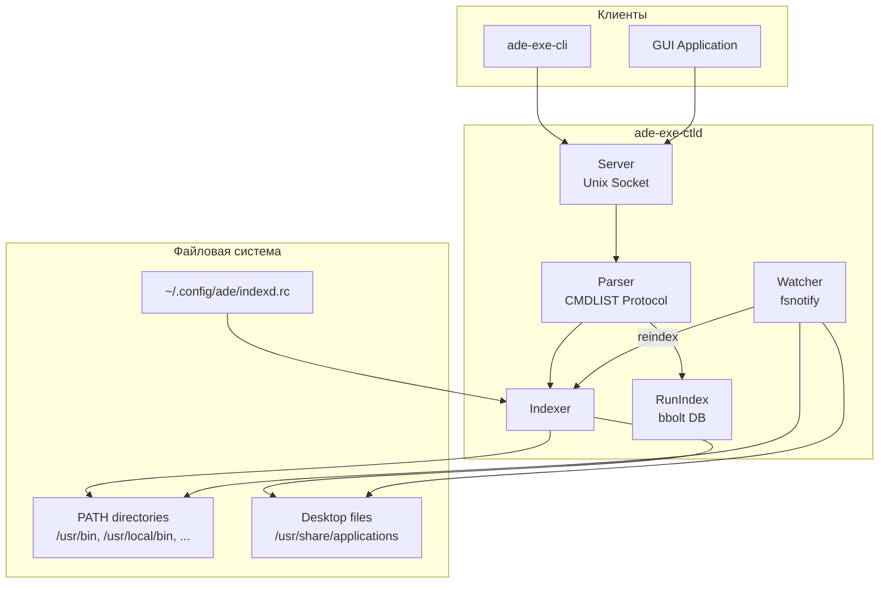
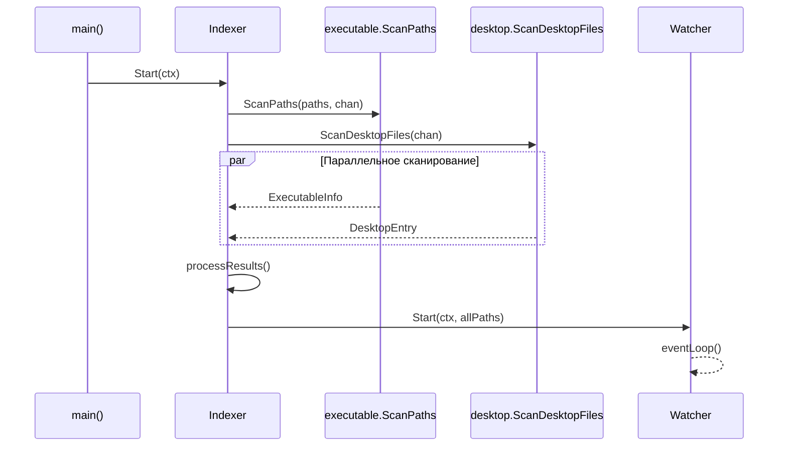
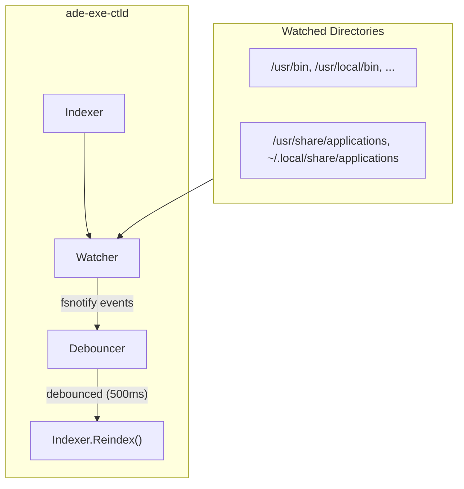
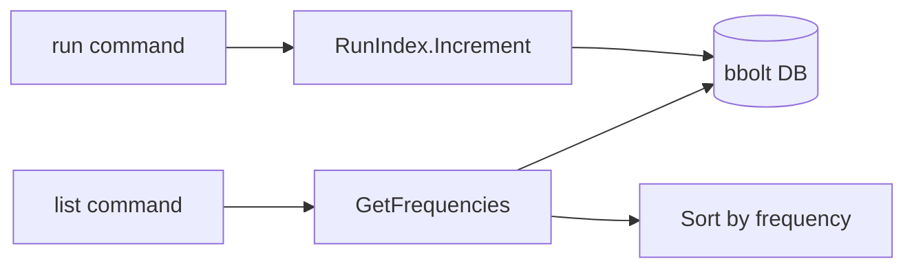

# ADE CTLD: Архитектура и использование

## Обзор

**ADE CTLD** — набор демонов для управления запуском приложений, открытием файлов и управлением окнами в среде Linux/WM. Демоны индексируют исполняемые файлы из PATH и .desktop файлы, предоставляя API для поиска и запуска приложений через Unix-сокеты.

## Компоненты системы



## Модули

### cmd/ade-exe-ctld

Главный демон для запуска приложений. Точка входа в систему.

**Жизненный цикл:**
1. Инициализация конфигурации (`config.Init()`)
2. Запуск наблюдателя за конфигом (`config.Run()`)
3. Создание и запуск индексатора (`indexer.Start()`)
4. Создание и запуск сервера (`server.Start()`)
5. Ожидание сигналов завершения (SIGINT, SIGTERM)
6. Graceful shutdown

### internal/config

Управление конфигурацией через переменные окружения и rc-файл.

**Переменные окружения:**
| Переменная              | Описание                                 | По умолчанию          |
|-------------------------|------------------------------------------|-----------------------|
| `PATH`                  | Директории для поиска исполняемых файлов | Системный PATH        |
| `ADE_DEFAULT_TERM`      | Терминал для запуска приложений          | xterm                 |
| `ADE_INDEXD_SOCK`       | Путь к Unix-сокету                       | /tmp/ade-{UID}/indexd |
| `ADE_INDEXD_WORKERS`    | Количество воркеров индексации           | 4                     |
| `ADE_INDEXD_LIST_LIMIT` | Лимит записей в ответе list              | 128                   |

**RC-файл:** `~/.config/ade/indexd.rc`

Содержит дополнительные пути для индексации (по одному на строку):
```
~/bin
~/apps
/opt/custom-apps
```

Файл автоматически перечитывается при изменении.

### internal/indexer

Ядро системы индексации приложений.

#### Структура Index

```go
type Entry struct {
    ID         int64             // Уникальный идентификатор
    Name       string            // Имя (английское или fallback)
    Names      map[string]string // Локализованные имена
    Path       string            // Путь к файлу
    Exec       string            // Команда запуска
    Terminal   bool              // Запуск в терминале
    Categories []string          // Категории приложения
    IsDesktop  bool              // Из .desktop файла
}
```

#### Процесс индексации



#### Watcher: Отслеживание изменений

Компонент `Watcher` автоматически отслеживает изменения в проиндексированных директориях.



**Особенности:**
- Использует `fsnotify` для отслеживания файловой системы
- Реагирует на события `Create` и `Remove`
- **Debounce 500ms** — группировка изменений для предотвращения частых переиндексаций
- Рекурсивное добавление новых поддиректорий
- Автоматический запуск полной переиндексации при изменениях

### internal/indexer/desktop

Парсинг `.desktop` файлов согласно [Desktop Entry Specification](https://specifications.freedesktop.org/desktop-entry/latest/).

**Стандартные директории:**
- `/usr/share/applications`
- `/usr/local/share/applications`
- `~/.local/share/applications`

**Поддерживаемые ключи:**
- `Name`, `Name[locale]` — имя приложения
- `Exec` — команда запуска
- `Terminal` — запуск в терминале
- `Categories` — категории (разделитель `;`)
- `NoDisplay` — скрытие из списка

### internal/indexer/executable

Сканирование исполняемых файлов в директориях PATH.

**Критерии включения:**
- Файл имеет права на выполнение (user, group, or others)
- Не является скрытым (не начинается с `.`)
- Не является директорией

### internal/runindex

Хранение статистики запусков приложений для сортировки по частоте использования.

**Хранилище:** bbolt (embedded key-value database)
**Файл:** `~/.cache/ade/exe-ctld.run-index`



### server

Обработка клиентских подключений через Unix-сокет.

**Поддерживаемые команды:**
| Команда        | Описание                            |
|----------------|-------------------------------------|
| `filter-name`  | Установить фильтр по имени (замена) |
| `+filter-name` | Добавить фильтр по имени            |
| `+filter-cat`  | Добавить фильтр по категории        |
| `+filter-path` | Добавить фильтр по пути             |
| `0filters`     | Сбросить все фильтры                |
| `list`         | Получить список приложений          |
| `list-next`    | Пагинация списка                    |
| `run`          | Запустить приложение                |
| `lang`         | Установить язык локализации         |
| `reindex`      | Принудительная переиндексация       |

### parser

Парсер протокола CMDLIST в стиле Forth (обратная польская нотация).

**Типы значений:**
- `<str>` — строка (префикс `"`)
- `<int>` — целое число
- `<bool>` — логическое значение (`t`, `f`, `or`, `and`, `not`)

**Пример команды:**
```
"firefox
filter-name
```

### client/exe

Go-клиент для взаимодействия с демоном.

```go
client, _ := exe.NewClient()
defer client.Close()

// Установить фильтр
client.SetFilterName("firefox")

// Получить список
apps, _ := client.List()

// Запустить приложение
client.Run(apps[0].ID)
```

## Протокол взаимодействия

См. подробную документацию: [cmdlist-protocol.md](cmdlist-protocol.md)

### Формат заголовка

```
TXT01  — текстовый формат, версия 01
```

### Формат ответа

```
<attrs block>
[blank line]
body:
<body content>
[blank line]
[blank line]
```

**Пример:**
```
len: 150
limited: 128
offset: 0
list-next: 128 128

body:
1 Firefox
2 Chromium
3 Code
...
```

## Использование

### Запуск демона

```bash
# Прямой запуск
./build/ade-exe-ctld

# С кастомным сокетом
ADE_INDEXD_SOCK=/run/user/1000/ade.sock ./build/ade-exe-ctld
```

### CLI-клиент

```bash
# Список всех приложений
ade-exe-cli list

# Фильтр по имени
ade-exe-cli filter-name firefox
ade-exe-cli list

# Запуск приложения
ade-exe-cli run 123

# Пагинация
ade-exe-cli list-next 128 64

# Интерактивный режим
ade-exe-cli interactive
```

### Интерактивный режим

```
> filter-name code
> list
len: 3

body:
42 Visual Studio Code
108 Code - OSS
156 codium

> run 42
cmd: run
idx: 42
status: 0
pid: 12345

> exit
```

## Сборка

```bash
# Сборка всех бинарников
make build

# Запуск тестов
make test

# Линтер
make lint

# Очистка
make clean
```

## Структура директорий

```
ade-ctld/
├── cmd/
│   ├── ade-exe-ctld/      # Демон запуска приложений
│   ├── ade-exe-cli/       # CLI-клиент
│   ├── ade-file-ctld/     # Демон файлов (TODO)
│   ├── ade-roam-ctld/     # Демон OrgRoam (TODO)
│   └── ade-wm-ctld/       # Демон WM (TODO)
├── client/
│   └── exe/               # Go-клиент для ade-exe-ctld
├── internal/
│   ├── config/            # Конфигурация
│   ├── indexer/           # Индексатор
│   │   ├── desktop/       # Парсер .desktop файлов
│   │   └── executable/    # Сканер исполняемых файлов
│   └── runindex/          # Статистика запусков
├── parser/                # Парсер CMDLIST протокола
├── server/                # Unix-socket сервер
├── doc/                   # Документация
└── tests/                 # Интеграционные тесты
```

## Зависимости

- `github.com/fsnotify/fsnotify` — отслеживание файловой системы
- `github.com/kelseyhightower/envconfig` — конфигурация через env
- `go.etcd.io/bbolt` — embedded key-value хранилище
- `github.com/onsi/ginkgo/v2` — тестовый фреймворк
- `github.com/onsi/gomega` — матчеры для тестов

